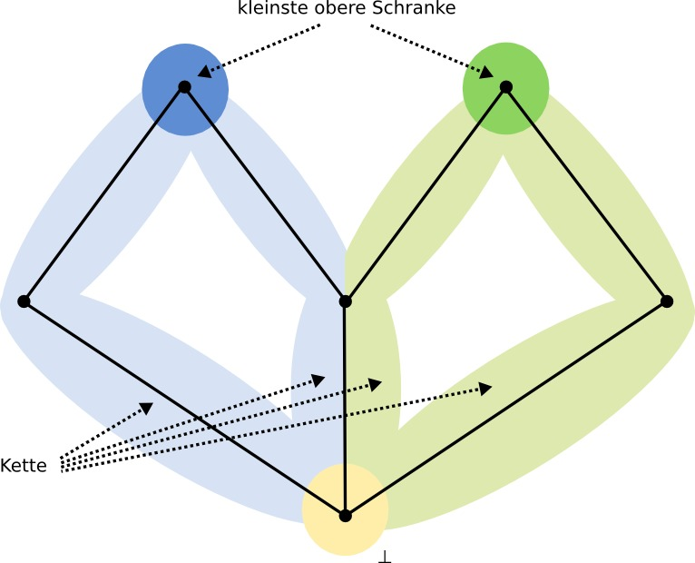

Semantik von Programmiersprachen 7
==================================
Jakob Pfender & Yves Müller

Aufgabe 1
---------

Wir beweisen, dass die gegebene Struktur ein cpo ist, indem wir zeigen, dass die
drei Kriterien aus dem Buch (Seite 59 / Def 3.3) gelten.

1. Gilt trivialerweise, da eine Halbordnung auch diese Kriterien erfüllen muss.

2. Gilt nach Annahme.

3. Wir nehmen an, es gibt für eine Kette *K* keine kleinste obere Schranke, dann
   für alle k in K existiert ein k' so dass k' > k und damit wäre die Menge nicht
   beschränkt (Widerspruch).

Aufgabe 2
---------

a) A ist ein cpo, da eine Halbordnung darauf definiert werden kann, ein
minimales Element existiert und jede Kette in A eine kleinste obere
Schranke besitzt. Die ersten beiden Bedingungen gelten trivialerweise; dass
die dritte Bedingung gilt, lässt sich unter zuhilfenahme des Beweises
aus Aufgabe 1 und der Tatsache, dass A endlich ist, herleiten.

b) A ist keine Kette; A enthält aber Ketten.

c) Es existiert keine kleinste obere Schranke von A - es existieren nur
kleinste obere Schranken der Ketten in A.

Aufgabe 3
---------

1. Die Vergleichsoperation über die natürlichen Zahlen N. Für die
   einzige Kette dieser Relation gibt es keine kleinste obere Schranke.

2. Die Teilgraphrelation (d.h.: G1 <= G2 gdw. G1 isomorph zu einem Teilgraphen 
   von G2) über die Menge aller endlichen nichtleeren Graphen, wobei der Graph
   mit nur einem Knoten das Bottom-Element ist. In dieser Menge gibt es keine
   kleinste obere Schranke für irgendeine Kette, da man stets eine weitere Kante
   mit einem Knoten anfügen kann.

Aufgabe 4
---------

::

    f(x) =  {  x  , wenn f(x) mod 2  = x
            {  0  , wenn f(x) mod 2 != x

    L = { x -> 0, x -> ⊥ }
